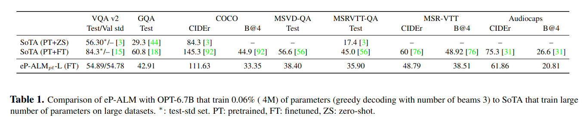

# eP-ALM: Efficient Perceptual Augmentation of Language Models

<p align="center">
    
</p>

<p align="center">
        <a href="https://mshukor.github.io/eP-ALM.github.io/">Project Page</a>&nbsp ｜ &nbsp<a href="https://huggingface.co/mshukor">Demo</a>&nbsp ｜ &nbsp<a href="#download">Checkpoints</a>&nbsp ｜ &nbsp<a href="https://aps.arxiv.org/abs/2303.11403">Paper </a>&nbsp
</p>

<p align="center">
    
</p>

Official implementation of the paper: 
- [eP-ALM: Efficient Perceptual Augmentation of Language Models](https://arxiv.org/abs/2303.11403)

In this repo, you will find the pretrained models and code to train and evaluate eP-ALM on Image/Video/Audio-Text tasks.

## News
* **[July-2023]** A [project page](https://mshukor.github.io/eP-ALM.github.io/) and a [demo](https://huggingface.co/mshukor) are now available.  
* **[July-2023]** The paper is accepted at ICCV23 !
* **[June-2023]** A new version of the paper is released on arXiv: 
    * We re-evaluate the models with greedy decoding.
    * We add comparison with SoTA.
    * We add new experiments, including pretraining on CC3M and evaluation in zero-shot (check Appendix).
* **[May-2023]** The code is optimized to train and evaluate with float16 mixed precision, using the accelerate library 🤗.
* **[May-2023]** We found greedy decoding with beam search is significantly better than multinomial/random sampling.
* **[20-March-2023]** The paper is released on arXiv.
* **[March-2023]** The paper is submitted for publication and currently under review. 

## Summary:

* [Introduction](#introduction)
* [Download](#download)
* [Installation](#installation)
* [Evaluation](#evaluation)
* [Accelerated Training 🤗](#accelerated-training)
* [Training](#training)
* [Citation](#citation)
* [Acknowledgment](#acknowledgment)


## Introduction


Large Language Models (LLMs) have so far impressed the world, with unprecedented capabilities that emerge in models at large scales. On the vision side, transformer models (i.e., ViT) are following the same trend, achieving the best performance on challenging benchmarks. With the abundance of such unimodal models, a natural question arises; do we need also to follow this trend to tackle multimodal tasks? In this work, we propose to rather direct effort to efficient adaptations of existing models, and propose to augment Language Models with perception. Existing approaches for adapting pretrained models for vision-language tasks still rely on several key components that hinder their efficiency. In particular, they still train a large number of parameters, rely on large multimodal pretraining, use encoders (e.g., CLIP) trained on huge image-text datasets, and add significant inference overhead. In addition, most of these approaches have focused on Zero-Shot and In Context Learning, with little to no effort on direct finetuning. We investigate the minimal computational effort needed to adapt unimodal models for multimodal tasks and propose a new challenging setup, alongside different approaches, that efficiently adapts unimodal pretrained models. We show that by freezing more than 99\% of total parameters, training only one linear projection layer, and prepending only one trainable token, our approach (dubbed eP-ALM) significantly outperforms other baselines on VQA and Captioning across Image, Video, and Audio modalities, following the proposed setup.


<p align="center">
    
</p>


### Results

> Comparison of eP-ALM with text generation-based SoTA that train significant number of parameters, including methods with large-scale pretraining. Best and next best scores are bolded and underlined respectively. FT: Finetuning. ZS: Zero-shot.

<p align="center">
    
</p>


> Qualitative results of eP-ALM: the model is able to generate accurate answers and coherent descriptions of the image. Ground truth answers are highlighted in green (with multinomial sampling and OPT350M).

<p align="center">
    
</p>


## Download

### OPT Model
First you need to download OPT models and tokenizers. You can use the following (for OPT-2.7B) to automatically download them:

```
from transformers import AutoTokenizer, OPTModel
tokenizer = AutoTokenizer.from_pretrained("facebook/opt-2.7b")
model = OPTModel.from_pretrained("facebook/opt-2.7b")
```

### Pretrain Encoders

You also need to download the different encoders from the following:
* Audio AST encoder from this [repo](https://github.com/YuanGongND/ast/tree/master/pretrained_models), specifically this [model](https://www.dropbox.com/s/ca0b1v2nlxzyeb4/audioset_10_10_0.4593.pth?dl=1).
* Video TimeSformer encoder from this [repo](https://github.com/facebookresearch/TimeSformer), specifically this [model](https://www.dropbox.com/s/4h2qt41m2z3aqrb/TimeSformer_divST_8x32_224_K600.pyth?dl=0).
* Image Encoder should be downloaded automatically from with the timm library, specifically we use the  [vit_base_patch16_224](https://storage.googleapis.com/vit_models/augreg/B_16-i21k-300ep-lr_0.001-aug_medium1-wd_0.1-do_0.0-sd_0.0--imagenet2012-steps_20k-lr_0.01-res_224.npz) model.

### Pretrained Models
We provide only the adaptation parameters (linear connection and Soft Prompt). You can download the following models:

For eP-ALM_pt-L (with OPT-6.7B and ViT-L), trained with float16 mixed precision (`accelerate_training`):
* VQA v2: [ePALM_pt_L](https://nuage.isir.upmc.fr/index.php/s/aSrCTKXsKQxAE72)
* COCO Caption: [ePALM_pt_L](https://nuage.isir.upmc.fr/index.php/s/PNrytqFbJWJqdt3)
* GQA: [ePALM_pt_L](https://nuage.isir.upmc.fr/index.php/s/9o7gk5gWY5ZNKLM)

In the following, we provide smaller models that used to obtain the main results in the paper. Note that these models are trained with float32:
* VQA v2: [ePALM](https://nuage.isir.upmc.fr/index.php/s/SMTJqfL62KC88z5)
* COCO Caption: [ePALM](https://nuage.isir.upmc.fr/index.php/s/y9KZr9CEpe42443)
* GQA: [ePALM](https://nuage.isir.upmc.fr/index.php/s/8rS84b4EH56CPZq)
* MSR-VTT Video Caption: [ePALM](https://nuage.isir.upmc.fr/index.php/s/nCj7mz7NHgeYokP)
* MSRVTT-QA Video QA: [ePALM](https://nuage.isir.upmc.fr/index.php/s/RysMQzH9sSf5b7P)
* MSVD-QA: [ePALM](https://nuage.isir.upmc.fr/index.php/s/LCdLN3xg35jGCP2)
* AudioCaps Audio Captioning: [ePALM](https://nuage.isir.upmc.fr/index.php/s/ZeeZc9zdFSgFTFC)

### Data
More details on the download and the organization of datasets can be found [here](docs/datasets.md)

## Installation
Main requirements:
```
python >= 3.8+
torch >= 1.12+
transformers >= 4.24+
accelerate >= 0.11.0
```
More details can be found [here](docs/installation.md).


## Evaluation
To evaluate the trained models, you can use the same scripts in `run_scripts/`, and just pass the best checkpoint path to the `--evaluate` arguments.

To visualize the results and test on your own images, you can use this notebook `ePALM.ipynb`.

You should use the same script used for training to evaluate the model (e.g., `run_scripts/accelerate_training` for models trained with accelerate).

Note that you can evaluate the models trained with float32 with `run_scripts/accelerate_training`, but the you might obtain slightly different results (e.g., for caption we obtain 102 CIDEr instead of 97 as reported in the paper).


## Accelerated Training 🤗
We optimized the code code based on the [accelerate](https://github.com/huggingface/accelerate) librairy. Mainly we train with mixed precision and keep the precision of the LM in float16, this significantly reduces the memory consumption (/2) and accelerates (x2) the training. 

For example, after specifying the path to `config` file, `data_dir` and `output_dir`,
to launch a training of eP-ALM_pt-L on VQA v2:

```
sh run_scripts/accelerate/image/ePALM_pt_L_vqa_acc.sh
```

To resume training, specify the initialization checkpoint to the `--resume` argument.


## Training
Previous models are trained with float32 precision. You can launch the training/evaluation of eP-ALM using the different scripts in `run_scripts/float32`. For example you can launch a training on VQA v2 from the following script:

```
sh run_scripts/float32/image/ePALM_vqa.sh
```

## Citation

```
@article{shukor2023ep,
  title={eP-ALM: Efficient Perceptual Augmentation of Language Models},
  author={Shukor, Mustafa and Dancette, Corentin and Cord, Matthieu},
  journal={arXiv preprint arXiv:2303.11403},
  year={2023}
}
```
## Acknowledgment

Some code was borrowed from [timm](https://github.com/rwightman/pytorch-image-models), [transformers](https://github.com/huggingface/transformers), [TimeSformer](https://github.com/facebookresearch/TimeSformer), and [VL-Adapter](https://github.com/ylsung/VL_adapter).


